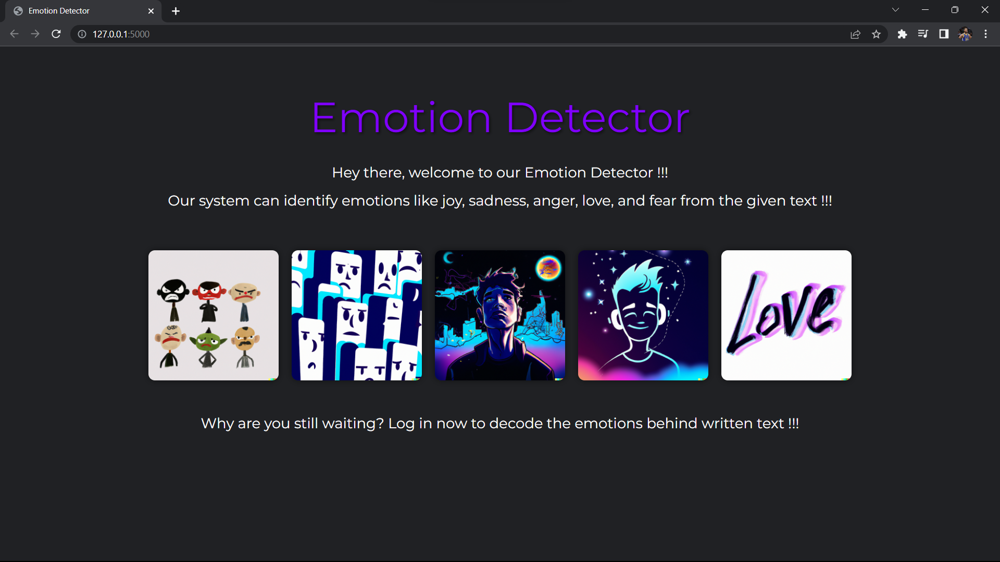
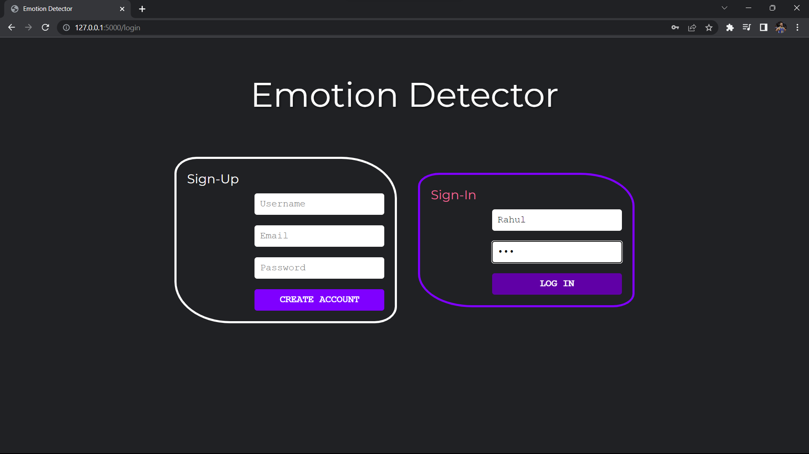
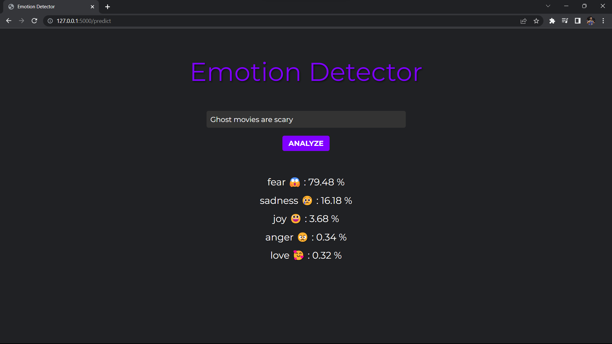

# Emotion Detector 🥰😱😃😠😢

A simple web application that detects emotions from the text using LSTM and pre-trained GloVe embeddings.

## Installation

To use this web application, you need to follow these steps:

```bash
# Clone the repository to your local machine.
git clone https://github.com/Mr-Appu/Text-Based-Emotion-Recognition.git

# Create a virtual environment and activate it.
python -m virtual env
\env\Scripts\Activate.bat

# Install the required dependencies.
pip install -r requirements.txt

# To run the app
flask run
```

## Features

* Login and Signup : You can create an account or login using your existing credentials.
* Emotion Detection : Once you have logged in, you can enter a text and the application will classify the emotions present in the text.
* Model Accuracy on Test-Data : 90.32

## Application

### Home Page 


### Login Page


### Classification

